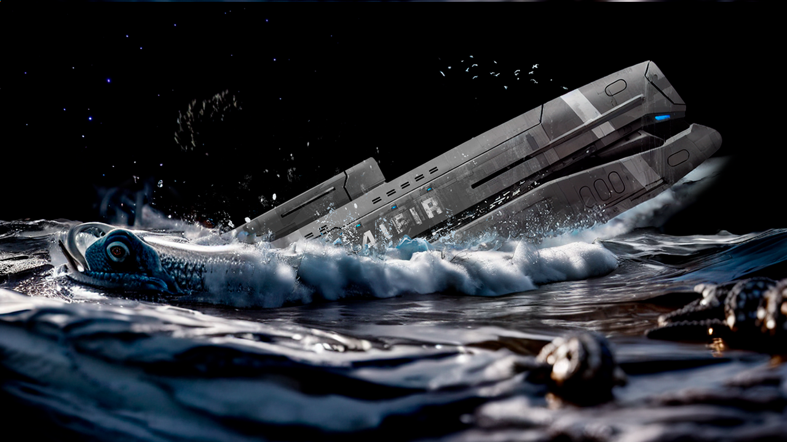

# 4IFIR 2.2 by **[Cooler3D](https://t.me/Cooler3D)**

[RUSSIAN GUIDE](README.md) | [Recommended Overclocking Settings](OPTIMAL_OVERCLOCKING.md) | [Telegram Group](https://t.me/kf4fr/48074) | [Update Tracking Bot](https://t.me/kf4fr/98339)

**4IFIR 2.2 supports HOS17+ and all console revisions 🎉**

**ATTENTION!: Kips from the older 4IFIR versions are not supported in 4IFIR 2.2.**

**The guide is still in progress! Pull-requests with fixes and suggestions are welcome. Mac OS users, in case of any problems, please read this [guide](https://gbatemp.net/threads/macos-fix-archive-attributes-for-switch-sd-card.545560/)** 

The guide is extensive. Use the search feature to navigate through it successfully.

A collection of modified components aimed at simplifying the overclocking of the Nintendo Switch, as well as enhancing the user experience through additional functionality. This modification is intended for those who want to maximize their console's capabilities, achieve PS4-level graphics (recommended in combination [with mods by ECLIPSE00074](https://4pda.to/forum/index.php?showuser=176532)), unlock 60fps, speed up load times, lock native resolution, reduce cooling system noise, etc.

In the case of 4IFIR, overclocking refers not to unlocking frequencies within standard tables, but actual overclocking, including undervolting/overvolting of each overclocked component. By installing the modification without theoretical preparation, you relieve the author of responsibility for any potential consequences, including console failure, and take full risk upon yourself. Overclocking cannot be absolutely safe by definition, you have been warned. Potential software problems can be mitigated by using EmuNand, FAT32, and having backups. To avoid conflicts, a clean installation is recommended.

## Table of Contents 
<!-- TOC -->
- [Table of Contents](#table-of-contents)
- [What 4IFIR Can Do](#what-4ifir-can-do)
- [4IFIR Components](#4ifir-components)
- [Installation](#installation)
  - [Installation (from Kefir or another build)](#installation-from-kefir-or-another-build)
  - [Updating (transitioning from previous versions), clean reinstallation](#updating-transitioning-from-previous-versions-clean-reinstallation)
  - [Additional Methods](#additional-methods)
    - [Installation from Scratch](#installation-from-scratch)
    - [Debug Installation (recommended method as it helps to avoid most problems when transitioning from other projects due to component conflicts)](#debug-installation-recommended-method-as-it-helps-to-avoid-most-problems-when-transitioning-from-other-projects-due-to-component-conflicts)
  - [How to Use 4IFIR](#how-to-use-4ifir)
  - [Enabling and Disabling Modules](#enabling-and-disabling-modules)
  - [Managing Console Operating Mode (Portable/Dock, ReverseNX-RT)](#managing-console-operating-mode-portabledock-reversenx-rt)
  - [Overclocking](#overclocking)
    - [Frequency and Governor Settings](#frequency-and-governor-settings)
    - [4IFIR Wizard Configurator](#4ifir-wizard-configurator)
  - [Getting More - Cheats and Patches for Graphics Enhancement](#getting-more---cheats-and-patches-for-graphics-enhancement)
    - [Cheats](#cheats)
    - [Modifications](#modifications)
    - [FPSLocker](#fpslocker)
  - [Optimizing Performance, Choosing Suitable Frequencies, and Power Consumption](#optimizing-performance-choosing-suitable-frequencies-and-power-consumption)
- [Problems and Their Solutions](#problems-and-their-solutions)
  - [Battery Issues](#battery-issues)
    - [The battery started to discharge from 100% to 1% in minutes, but works fine at 1% for several hours](#the-battery-started-to-discharge-from-100-to-1-in-minutes-but-works-fine-at-1-for-several-hours)
    - [When playing with overclocking enabled, the empty battery icon appears after some time](#when-playing-with-overclocking-enabled-the-empty-battery-icon-appears-after-some-time)
    - [The game stopped launching and started crashing](#the-game-stopped-launching-and-started-crashing)
    - [The Witcher 3/Resident Evil Revelations won't start](#the-witcher-3resident-evil-revelations-wont-start)
    - [FPS in the game always shows 0/254 or ReverseNX doesn't switch modes](#fps-in-the-game-always-shows-0254-or-reversenx-doesnt-switch-modes)
- [FAQ](#faq)
- [Licenses](#licenses)
- [Acknowledgements](#acknowledgements)
- [Editing](#editing)
<!-- /TOC -->
## What 4IFIR Can Do

* Overclock up to 3009 MHz for CPU, 1497 MHz for GPU, 3000 MHz for RAM (the exact ceiling value is individual for each console)
* Automatic undervolting/overvolting
* Automatic boost when loading a game
* Governor support - reducing resource consumption when they are not needed by the console
* Video recording without restrictions in all games, except for a few unsupported ones
* Wireless video streaming with increased bitrate, 60 frames per second, to external monitors - virtually no delay
* Dock mode emulation
* Accelerated charging
* Lower current threshold for Official Charger
* Radical reduction of cooling system noise
* Overlay with FPS and system metrics
* On-screen menu for on-the-fly control of the listed features
* Background FTP server
* Necessary system modules for the operation of all the above

## 4IFIR Components

1. **[4efirosphere](https://cloud.sintez.io/s/4IFIR?path=%2FMariko)**, a fork of [Atmosphere](https://github.com/Atmosphere-NX/Atmosphere) that unlocks the console's overclocking potential
2. **[Sigpatches](https://jits.cc/patches)**, unlocking the console's gaming potential
3. **[hekate](https://cloud.sintez.io/s/4IFIR)**, a fork of [hekate](https://github.com/CTCaer/hekate) that unlocks the console's memory overclocking potential
4. **Installed Payloads**:
   * [Lockpick_RCM](https://github.com/shchmue/Lockpick_RCM) - a program for dumping console keys
   * [TegraExplorer](https://github.com/rashevskyv/TegraExplorer/) - a low-level file manager for system operations
5. **Installed Homebrew**:
   * [AiO Switch Updater](https://github.com/rashevskyv/kefir-updater) - a program for updating 4IFIR to the latest version
   * [Homebrew App Store 2.3.2](https://github.com/fortheusers/hb-appstore/releases) - an app store
   * [Daybreak](https://github.com/Atmosphere-NX/Atmosphere/tree/0.14.1/troposphere/daybreak) - a program for system software updates
   * [DBI](https://github.com/rashevskyv/dbi) - potentially the best file manager, save manager, and app installer for the console
   * [Fizeau](https://github.com/averne/Fizeau) - a program that allows you to change the display color settings on the screen
   * [SysDVR](https://cloud.sintez.io/s/4IFIR), a fork of [SysDVR](https://github.com/exelix11/SysDVR) - a program for wireless image transmission from the console to a PC or other devices
   * [sys-ftpd](https://cloud.sintez.io/s/4IFIR), a fork of [sys-ftpd](https://github.com/cathery/sys-ftpd) - an FTP server that runs in the background
   * [Mhz] – a program for CPU testing
   * [MicroMemBench] – a program showing memory performance results
   * [MicroMemTest] – memory stress test
   * [RaytracingNX] - a program for GPU testing.

1. **Installed Modules**. Modules are additional components that work inside Atmosphere and allow you to do various cool things, such as using Xbox-compatible controllers, emulating amiibo, overclocking, and more.
   * [SaltyNX](https://cloud.sintez.io/s/4IFIR), a fork of [SaltyNX](https://github.com/masagrator/SaltyNX), a background module that allows modifying files/processes on the console, supports plugins. Not compatible with 32-bit games (see the project's GitHub for a list). Required for some other modules to work (e.g., ReverseNX).
   * [ReverseNX-Tool](https://cloud.sintez.io/s/4IFIR), a fork of [ReverseNX-Tool](https://github.com/masagrator/ReverseNX-Tool) - a program that forcibly changes the console's operating modes to dock and portable, regardless of whether the console is in the dock or not. Potentially improves the picture in portable mode by rendering the image as if the console is in the dock.
   * [sys-clk](https://cloud.sintez.io/s/4IFIR), a fork of [sys-clk](https://github.com/retronx-team/sys-clk), a module responsible for overclocking the CPU, memory, GPU, which leads to better performance.
   * [sys-con](https://github.com/cathery/sys-con) - a module that allows you to connect almost any gamepad to the console via USB.
   * [Uberhand Overlay Menu](https://cloud.sintez.io/s/4IFIR), a fork of [Uberhand Overlay Menu](https://github.com/efosamark/Uberhand-Overlay) - a special overlay menu for interacting with the system: overclocking, controlling modes via ReverseNX, enabling cheats, etc.
     - [FPSLocker](https://github.com/masagrator/FPSLocker) - an overlay that allows you to lock FPS in games.
     - [nx-ovlloader](https://github.com/WerWolv/nx-ovlloader/) - this module allows switching installed modules through Uberhand.
     - [ovlEdiZon](https://github.com/proferabg/EdiZon-Overlay/releases) - an overlay for using cheats.
     - [ovlSysmodules](https://github.com/WerWolv/ovl-sysmodules/) - an overlay for enabling and disabling installed system modules.
     - [InfoNX-ovl](https://github.com/renA21/InfoNX/) - an overlay displaying information about the battery/CPU/GPU/DRAM(EMC).
     - [QuickNTP](https://github.com/nedex/QuickNTP) - an overlay for synchronizing the clock via the internet, since the native one in 4IFIR is disabled.
     - [Status-Monitor-PRO](https://cloud.sintez.io/s/4IFIR), a fork of [Status-Monitor-Overlay](https://github.com/masagrator/Status-Monitor-Overlay) - a module for real-time console parameter monitoring. Can act as an FPS counter in the upper left corner of the screen.
     - [sys-ftpd-ovl](https://github.com/SegFault42/sys-ftpd-ovl) - an overlay for operating sys-ftpd through Uberhand.
     - [sysdvr-overlay](https://github.com/Hartie95/sysdvr-overlay), a fork of [sysdvr-overlay](https://github.com/Hartie95/sysdvr-overlay) - an overlay for configuring SysDVR through Uberhand.
     - [sys-clk overlay](https://github.com/retronx-team/sys-clk) - an overlay for managing overclocking through Uberhand.
     - [Fizeau overlay](https://github.com/averne/Fizeau)  - an overlay for configuring Fizeau through Uberhand.
     - [ReverseNX-RT overlay](https://github.com/masagrator/ReverseNX-RT) - an overlay for switching the console's operating mode through Uberhand.

## Installation

**IMPORTANT! Strictly follow the instructions and do not deviate from them. In case of problems, refer back to the instructions and reinstall 4IFIR from scratch.**

Some Switch models on version 4IFIR 1.9 have a sleep issue, please refer to the [help chat](https://t.me/kf4fr/205364) (there's a workaround that solves the problem: *when asked about reinstalling hekate, select **Yes***, the project's author is aware of the issue, and it's being worked on). In the latest version, 4IFIR 2.2, the issue has been largely resolved, and the workaround from the previous version works.

The versioning of 4IFIR is very conditional (to put it simply, it doesn't really exist), so many updates can be released without changing the version of 4IFIR at all. You can follow new versions in the [4IFIR chat](https://t.me/kf4fr/48074), or on [this page](https://github.com/rashevskyv/4ifir-checker), which will show when a new version was released and what specifically has changed. [The update is done through AIO](#updating-transitioning-from-previous-versions).

### Installation (from Kefir or another build)
1. Unzip [All in One Updater with 4IFIR's config](https://sintez.io/AIO.zip) to the console's memory card
   * Some providers in Ukraine block `sintez.io`, you can use [an alternative link to All in One Updater with 4IFIR's config from github](https://github.com/rashevskyv/4ifir-checker/raw/main/github/AIO.zip). *Also suitable in case of `sintez.io` server downtime*.
1. Launch [**Homebrew Launcher**](https://switch.customfw.xyz/hbl) > **All in One Updater**
   * If you get a black screen instead of the application launching, manually redownload the application from its [repository](https://github.com/HamletDuFromage/aio-switch-updater) and manually enter this address in Custom downloads > Add custom link `https://sintez.io/AIO.zip`, then restart the application
1. Go to **Custom Downloads** > **4IFIR 2.2** > **Continue**, when asked about overwriting `ini`, choose **Yes**, when asked about reinstalling hekate choose **No**, the console will restart

### Updating (transitioning from previous versions), clean reinstallation
1. Launch [**Homebrew Launcher**](https://switch.customfw.xyz/hbl) > **All in One Updater**
   * If you get a black screen instead of the application launching, manually redownload the application from its [repository](https://github.com/HamletDuFromage/aio-switch-updater) and manually enter this address in Custom downloads > Add custom link `https://sintez.io/AIO.zip`, then restart the application
1. Go to **Custom Downloads** > **Refresh** > **Continue**, when asked about overwriting `ini`, choose **Yes**
1. Go to **Custom Downloads** > **4IFIR 2.2** > **Continue**, when asked about overwriting `ini`, choose **Yes**, when asked about reinstalling hekate choose **No**, the console will restart

### Additional Methods
* **Installation from scratch** is needed _only_ for those who do not have any system installed at all, but already have the ability to launch it from a memory card (for example, a chip is installed).
* **Debug installation** is a method that should be used _only_ when you understand what you are doing, or if [a competent person](https://t.me/Cooler3D) has asked you to do so.

#### Installation from Scratch
1. Unzip [4IFIR](https://sintez.io/4IFIR.zip) onto the console's memory card
   * The card should be formatted in [FAT32](https://format.customfw.xyz)
   * It is recommended to work with the memory card through a card reader, not through the console.
   * Some providers in Ukraine block `sintez.io`, you can use [an alternative link for 4IFIR from github](https://github.com/rashevskyv/4ifir-checker/raw/main/github/4IFIR.zip). *Also suitable in case of `sintez.io` server downtime*.
1. Insert the card into the console and turn it on

#### Debug Installation (recommended method, as it helps to avoid most problems when transitioning from other projects due to component conflicts)
**Only perform if you encounter problems with the methods above**
1. Delete everything from the memory card except for the Nintendo folder and emummc (if present) (Do not delete the folder with save backups, e.g., JKSV)
   * The card should be formatted in [FAT32](https://format.customfw.xyz)
   * It is recommended to work with the memory card through a card reader, not through the console.
2. Unzip [4IFIR](https://sintez.io/4IFIR.zip) onto the console's memory card
   * Some providers in Ukraine block `sintez.io`, you can use [an alternative link for 4IFIR from github](https://github.com/rashevskyv/4ifir-checker/raw/main/github/4IFIR.zip). *Also suitable in case of `sintez.io` server downtime*.
3. Insert the card into the console and turn it on

## How to Use 4IFIR

All settings are made through the Uberhand menu, which is accessed by pressing the combination of keys `(L)+(R)+(▲)`, where `(L)` is the top bumper of the left Joy-Con, `(R)` is the top bumper of the right Joy-Con, and `(▲)` is the up button on the d-pad.

**You can set any combination in the file `/config/uberhand/config.ini`**

After pressing these three buttons simultaneously, the Uberhand menu appears with the following items:

* **FPSLocker** - module for locking frame rates in games
* **Fizeau** - module for managing the display and its color profiles
* **InfoNX** - module showing extended information about the console's power consumption
* **QuickNTP** - module that allows synchronizing the clock via the internet since the built-in synchronization method in 4IFIR is disabled
* **ReverseNX-RT** - module that allows forcibly choosing the console's operating mode (portable or docked)
* **Status Monitor** - module showing system performance metrics in real-time over the screen without taking control away from the game. There are many operating modes, including a mode that allows displaying frequency and FPS counters in the upper left corner of the screen
* **EdiZone** - module for managing cheats
* **Sysmodules** - module for managing modules. Allows enabling/disabling installed modules
* **4IFIR Shaitan** - module for managing overclocking profiles
* **SysDVR Overlay** - module managing streaming of the console's display to a PC via WiFi or cable

Pressing **(A)** on an item opens its personal menu.

### Enabling and Disabling Modules

The **Sysmodules** module allows enabling and disabling selected modules, as well as managing their autostart. Keep in mind that some modules can be enabled and disabled without rebooting, but some modules require rebooting the console after enabling. 

To the right of the module name, its status is indicated, for example, **On | x**, where On indicates the current state of the module (On - enabled, Off - disabled), and **x** indicates whether the module is set to autostart (**x** - not set, **house icon** - set).

The **(A)** button can be used to enable or disable the module. The (Y) button toggles the module's autostart. If pressing the (A) button does not change the module's state, it means it can only be managed by rebooting the console. Enable the module's autostart and reboot the console for it to start working, or disable and reboot to stop it.

Modules that can be enabled at any time are grouped at the top under **Dynamic**, and those that require a reboot under **Static**.

### Managing Console Operating Mode (Portable/Dock, ReverseNX-RT)

The **ReverseNX-RT** module allows forcibly enabling dock mode while playing in portable mode and vice versa. Use the **Change system control** button to enable forced control of mode switching (displayed in the **Controlled by system** line, the **No** position means that modes can be manually changed). After that, you can switch modes with the Change mode button (displayed in the **Mode** line, where **Docked** is the dock mode, **Handheld** is portable).

It's important to understand that in dock mode, the console forcibly increases the CPU frequencies, which results in a better picture but faster battery drain.

### Overclocking

In 4IFIR, overclocking is achieved through deep optimizations of HOS components. The efficiency of the hardware in terms of watts is approximately 3-5 times higher than at stock frequencies without overclocking. All this is thanks to breakthrough memory optimizations (overcoming the frequency and timing threshold). In 4IFIR, undervolting of the CPU/GPU/Memory is implemented, and thanks to optimizations, 4IFIR consumes energy much more efficiently during overclocking compared to its competitors.

For more effective overclocking tailored to your console, you need to configure the parameters in 4IFIR Wizard (more about the configurator below) on which your console is capable of operating. All this is done experimentally and individually for each specific console and, moreover, for each specific game.

#### Frequency and Governor Settings

Overclocking settings are made through the **4IFIR Shaitan overlay** module. The modules are located in **Underhand**, which is opened by the combination **(L)+(R)+(▲)**.

The header contains the following parameters:
* **App ID** - shows the titleid of the running game
* **Profile** - this parameter is synchronized with the ReverseNX-RT settings (if the corresponding setting is enabled in the parameters) and shows in which mode the console is currently operating (**Docked** - dock mode, **Handheld** - portable)
* **CPU** - current CPU frequency
* **GPU** - current GPU core frequency
* **MEM** - current memory frequency
* **SOC** - processor temperature (SoC - System on Chip, means that both the video core and central processor are on the same chip, so they share the same temperature)
* **PCB** - console board temperature
* **Skin** - console temperature (?)

* **Enable** - responsible for activating overclocking. On - enabled, Off - disabled
* **Edit app Profile** - setting the overclocking profile for the running application. The specified settings will be automatically applied when launching the application. They have medium priority.

* Advanced
   * **Temporary overrides** - overclocking settings for all applications. The specified settings are applied to all launched applications and are valid until the console is rebooted. They have the highest priority.
   * **Global profile** - overclocking settings for all applications. The specified settings are applied to all launched applications. They have the lowest priority.
   * **Miscellaneous** - additional console settings, such as limiting the charging voltage, auto-boost, limiting the charging percentage, and others. These will be discussed separately.

Overclocking is achieved by changing the maximum frequency for the CPU/GPU/Memory through the **Edit app Profile**/**Temporary overrides**/**Global profile** overclocking settings. The settings will be applied depending on their priority (**Temporary overrides** -> **Edit app Profile** -> **Global profile**). The highest priority is given to **Temporary overrides**; if no settings are specified there, the program looks at the settings from **Edit app Profile**; if it's empty, then the settings from **Global profile** are applied. And if there are no settings there either, then the default system settings (**Default**) are applied.

**Global profile** and **Edit app Profile** contain a division into profiles:
  * **Docked**
  * **Handheld**
  * **Charging**
  * **Official Charging**
  * **USB Charger**

Profiles also have their own priority. From highest to lowest: **Docked** -> **Official Charging** / **USB Charger** -> **Charging** -> **Handheld**. The principle of application is exactly the same. The **Docked** mode has the highest priority and overwrites the values of lower priority profiles. **Official Charging** or **USB Charger** have the same priority and overwrite the values of **Charging** and **Handheld** profiles, and so on.

**Docked** and **Handheld** profiles are synchronized with Reverse-NX settings (can be disabled in **Miscellaneous** of the **4IFIR Shaitan** module) and depend on the console's operating mode (dock/portable). The **Charging** profile is activated when any charger is connected to the console. The **Official Charger** profile is activated when the original charger is connected, or any other charger that supports the Power Delivery protocol. The **USB Charger** profile is activated when any other charger is connected. Thus, you can set up a separate overclocking profile for charging from any source and separately for powerful or low-power ones, with the latter having a higher priority.

**Edit app Profile** includes governor management.

Governor, in the context of CPU frequency management, is a program or mechanism that controls the operating frequency of the CPU and its power consumption.

The essence of a governor's work is to determine the optimal CPU operating frequency depending on its workload. If the CPU is not under load, the governor can reduce its frequency to lower energy consumption and reduce heat emission. If the CPU receives a high workload, the governor can increase its frequency to ensure high performance.

* **CPU Freq Governor** - enable or disable frequency management for the **central** processor
* **GPU Freq Governor** - enable or disable frequency management for the **graphic** processor

Both of these items will be available only if **Frequency Governor (Experimental)** is activated in **Miscellaneous**.

Enabling the GPU governor in some games can lead to stuttering or FPS drops (for example, Metroid Prime Remastered occasionally drops FPS to 30 when exiting the map to the game). If you experience this in your game, disable the governor for the GPU.

Each of the profiles contains separate items for overclocking **CPU**, **GPU**, and **Memory**. It's easy to understand what each is responsible for by its name. In each of these items, there is a **Default** value, which is the default value taken from the previous priority overclocking setting (Temporary/App/Global/System value) from the corresponding priority profile. Working frequencies are selected individually for each specific game on each specific console. More details on selecting frequencies will be discussed later.

* **Miscellaneous** - a section with additional settings. It contains the following options:
   * **Auto CPU Boost** - active auto boost layer. Increases CPU frequency under system core load, which usually means data loading, texture streaming, locations, etc. It's better to disable on Erista as it affects battery life.
   * **Sync ReverseNX Mode** - a setting that synchronizes the ReverseNX value state with the sys-clk profile. That is, if ReverseNX is set to **Handheld**, then the active profile in sys-clk will be **Handheld**, if **Docked**, then **Docked** accordingly.
   * **Frequency Governor (Experimental)** - enables governors in **Edit app Profile**.
   * **Charging current** - charging current limit.
   * **Charging Limit** - the limit to which the console will charge.
   * **Force Disable Charging** - an option that allows not to charge the battery while running on a charger. That is, the battery will not deplete but also will not charge either. It helps to avoid problems with battery desynchronization.
   * **Screen Backlight** - disables screen backlight. Useful in conjunction with sys-dvr.
   * **Info** - various metrics:
      * **Charger** - the type of charging device connected to the console. Shows voltage, amperage, and power in Watts.
      * **Battery** - battery voltage and temperature.
      * **Current Limit** - 
      * **Charging Limit** - the value specified in **Charging current**.
      * **Raw Charge** - Battery charge provided by the charging controller.
      * **Battery Age** - battery "health".
      * **Power Role** - 
      * **Current Flow** - current consumption.
      * **CPU Volt** - CPU voltage.
      * **GPU Volt** - GPU voltage.
      * **DRAM Volt** - memory voltages.

#### 4IFIR Wizard Configurator

**4IFIR Wizard** is a package that allows fine-tuning parameters for your console. If 4IFIR is unstable or you want to increase the console's performance, **4IFIR Wizard** is your indispensable assistant.

To access **4IFIR Wizard**, open **Underhand** with the combination **(L)+(R)+(▲)**, then press **(►)** to enter the package menu, and select **4IFIR Wizard**.

Inside, the following menus are available:
* **Full Assist** - sequential setting of the console's operating parameters (the operation of this setting is described below).
* **Manual Configuration** - menu for individual setting of each parameter.
* **Backup** - menu for creating and managing backups.
* **About** - menu containing information about the package and the current configuration.

In some sections where **🅨 Help** is available at the bottom of the screen, there is a short description of the purpose.

Inside the **Manual Configuration** menu, there are three main sections:
* **Quick Setup** – setting the main parameters for CPU/GPU/RAM:
  * **CPU** - CPU settings.
    * CPU Boost Mode – selection of the frequency to which the game will be overclocked on loading screens.
    * CPU VMAX Mode – the maximum possible power consumption of the CPU.
    * CPU Low Undervolt Mode – undervolt levels for CPU frequencies below <=15хх Mhz. There are 6 values, Default – the default value, and five levels from 1-5, the higher the level, the more aggressively the consumption is reduced.
    * CPU High Undervolt Mode – undervolt levels for CPU frequencies above >15хх Mhz. There are 4 values, Default – the default value, and three levels from 1-3, the higher the level, the more aggressively the consumption is reduced.
    * CPUv Mode - the minimum possible power consumption of the CPU.
  * **GPU** - GPU settings.
    * Gpu Eco Mode – selection of the undervolt level across the entire GPU frequency grid. There are 4 lines: 1- Default, 2–3 levels (the higher, the more aggressive the undervolt), Manual – values from the table in Advanced Settings.
    * GPUv Mode – levels of the lowest possible power consumption of the GPU. There are 3 lines numbered 1–3 (left), the higher the number, the lower the minimum power consumption.
  * **RAM** – memory settings.
  * GPU Overvolt - levels of the maximum power consumption of the GPU.
    * 4IFIR RAM Mode – selection of the memory frequency that will be available in the 4IFIR Shaitan>Edit app profile/Temporary overrides/Global profile>Memory>4IFIR Optimized overclocking menu. There are three sections: Low freq – recommended for the console's economical mode, Medium Freqs – for a more performance-oriented mode of the console, both in portable and docked mode, High freqs – the most performance-oriented mode of the console with increased consumption of all console components CPU/GPU/RAM, recommended for playing in docked mode (these values may allow users who were lucky with the memory chip, there are 27 variants).
    * VDD2 Mode – Maximum memory consumption. This menu selects the undervolt levels. There are 4 values: Auto - automatic selection of values, and three levels 1–3 (left), the higher the number, the lower the consumption.
    * VDDQ Mode – Minimum memory consumption. This menu selects the undervolt levels. There are 4 values: Auto - automatic selection of values, and three levels 1–3 (left), the higher the number, the lower the consumption.
    * RAM DVB Mode - This setting controls the internal adaptive mechanism of the memory controller. There are 4 values: Auto - automatic selection of values, and three levels 1–3 (left), the higher the number, the lower the consumption.
    * Timings Orchestrator – Setting of memory timings from presets prepared in advance by the developer. There are seven presets Timings Preset 1–7. Presets do not affect each other. Adjust each parameter separately to achieve maximum stable performance. The higher the value of each timing, the higher the performance.
* **System Setting** – setting of the console's fan operation and video capture:
  * **Fan Control** - setting of the fan operation.
    * Max fan speed at 16°C-35°C 0%
    * Max fan speed at 36°C-40°C 20%
    * Max fan speed at 41°C-46°C 30%
    * Max fan speed at 47°C-57°C 60%
    * Max fan speed at 58°C-100°C 100%
  * **Video Capture Settings** – video capture settings.
    * Bitrate – video bitrate.
    * FPS - frames per second.
  * Reset to Base – reset to default values.
* **Complete [Reboot]** – apply settings and reboot the console.

* **Advanced Settings** – advanced setting of CPU/GPU/RAM parameters:
  * **CPU** - processor settings.
    * CPU Minimal Voltage – selection of the lower power consumption threshold for the processor.
    * CPU Maximum Voltage – selection of the upper power consumption threshold for the processor.
    * dCPUv - selection of power consumption threshold for frequencies below <=15xx Mhz.
    * CPU Boost Clock – selection of the frequency to which the game will overclock on loading screens.
    * Low Mhz Undervolt – undervolt levels for CPU frequencies below <=15xx Mhz. There are 6 values, 0 – default value and five levels from 1-5, the higher the level the more aggressively consumption is reduced.
    * High Mhz Undervolt – undervolt levels for CPU frequencies above >15xx Mhz. There are 8 values, 0 – default value and seven levels from 1-7, the higher the level the more aggressively consumption is reduced.
    * Speed Shift - a secret component of 4ifir that unlocks the console's potential. The higher the value, the lower the consumption.
* **GPU** - GPU settings.
  * Gpu Undervolt Mode – selection of undervolt level across the entire GPU frequency grid. There are 4 lines: 1- Default, 2–3 levels (the higher the more aggressive the undervolt), Manual – values from the table in Advanced Settings.
  * GPU Minimal Voltage – selection of the lower power consumption threshold for the GPU.
* **Advanced Settings Table** – setting of precise power consumption adjustments for each GPU frequency separately.
  * **RAM** - memory settings.
    * RAM Mhz – selection of memory frequency that will be available in the 4IFIR Shaitan>Edit app profile/Temporary overrides/Global profile>Memory>4IFIR Optimized overclocking menu. There are three sections: Low freq – recommended for the console's economical mode, Medium Freqs – for a more performance-oriented mode of the console, both in portable and docked mode, High freqs – the most performance-oriented mode of the console with increased consumption of all console components CPU/GPU/RAM, recommended for playing in docked mode (these values may allow users who were lucky with the memory chip, there are 27 variants).
    * RAM Vddq – selection of the minimum power consumption threshold for memory.
    * RAM Vdd2 – selection of the maximum power consumption threshold for memory.
    * Ebalance – a set of memory operation optimizations in terms of energy efficiency-performance ratio. There is a list of 5 values. 3 – default value (Recommended). 2 – Adds performance and reduces consumption (Can be tried, stable on most consoles), 4 – For high frequencies from the Higs freqs block (for playing in docked mode), 1 – even more energy-efficient and performant set for the Eco mode of console operation, but so far works on a small number of devices (under development), 0 – empty value. The lower eBAL - the better timings you can set. The higher eBAL, the higher frequency you can set.
    * Eba-shift - Soon
    * EMC DVB Mode - This setting controls the internal adaptive mechanism of the memory controller. Selection of a more accurate power consumption value.
    * Core Timings – Memory timings setting. There are eight timings Core Timings 1–8. Timings do not affect each other. Adjust each parameter separately to achieve maximum stable performance. The higher the value of each timing, the higher the performance.
    * pMeh 0-15 - soon pMeh15 - On ERISTA, eBAL 3, works by default as eBAL 4, the addition per unit is controlled through .pMeh15 0-1, by default one, if switched to 0 eBAL will correspond to the value for MARIKO. By default, it has 3.
    * sMeh 0-11 - soon
    * Shaitan - soon
* **Complete [Reboot]** – apply settings and reboot the console.

* **Timing Settings Recommendation**
  * Core Timings [1-8] - timing settings. Each Core Timings item is responsible for its set of timings, allowing individual tuning. The higher the value, the higher the performance, but too high values can lead to crashes depending on the memory model. For fine-tuning - lower all values to 1, then increase each parameter by one (with subsequent reboot), checking stability. In case of a crash or artifacts - reduce this value by 1 and move to the next Core Timings item. Sometimes you might see timing designations like 365532 or 3-6-5-5-3-2. Each digit corresponds to the Core Timings setting. For example, in the case above: Core Timings 1 is set to 3, Core Timings 2 to 6, and so on. "0 modes of timings are for debugging. If in some scenario 0 works stably but 1 does not, it's a reason to report the combination of parameters, memory chips, etc."

**IMPORTANT:** to apply changes - select the Complete [Reboot] item in the Manual Configuration menu or reboot the console.

In 4IFIR Wizard, there's a mechanism for creating backups of your configurations. To manage backups, select the Backup item in the main menu. Inside, three options are available:

* Create backup - allows you to create a new backup from the current configuration. Backups are located at /atmosphere/kips/.bak. A new backup replaces the previous one.
* Manage Backups - allows you to apply a created backup or delete it.

From version 1.9, 4IFIR Wizard supports FULL ASSIST.

1. Launch Full Assist (open the Uberhand menu (L)+(R)+(▲), then press (►) and open 4IFIR Wizard. Then open Full Assist>Start and proceed to setup.
2. You will be asked to choose one of the 8 memory frequency options in the blocks Low Freq/Medium Freqs/High freqs, after which the console will restart, launch a game (Recommended Legend of Zelda TOTK), set Memory overclock in the 4IFIR Shaitan menu and play for about 15 minutes, if the console is stable, then run 4IFIR Wizard again and move on to the next setting, or if unstable behavior of the console is noticed, set the current setting lower.

The set of settings in **Full Assist** is identical to the settings in **Quick Setup**, except for a couple of items, which are currently only available in the assistant (Work in progress). Some assistant items have different names from Quick Setup, this will be corrected in the future. Therefore, see the description of the parameters above in the Quick Setup section.

* 4IFIR RAM Mode (4IFIR RAM Mode in Quick Setup)
* CPU Max freq (CPU Boost Mode in Quick Setup)
* CPU max Volt (CPU VMAX Mode in Quick Setup)
* RAM EMV (VDD2 Mode in Quick Setup)
* RAM EMQ Mode (VDDQ Mode in Quick Setup)
* CPU Low Undervolt (CPU Low Undervolt Mode in Quick Setup)
* GPU Undervolt (GPU Eco Mode in Quick Setup)
* CPU MinVolt (CPUv Mode in Quick Setup)
* GPU Under Mode (GPUv Mode in Quick Setup)
* RAM DVB Mode (RAM DVB Mode in Quick Setup)
* Timings Preset 1
* Timings Preset 2
* Timings Preset 3
* Timings Preset 4
* Timings Preset 5
* Timings Preset 6
* Timings Preset 7
* Speed Shift - not present in Quick Setup, choose Default and proceed to the next parameter.
* CPU High mHz Undervolt (CPU High Undervolt Mode in Quick Setup)
* GPU Overvolt (GPU Over Mode) not present in Quick Setup, choose Default and proceed to the next parameter.
* CPU Min-High Voltage (dCPUv in Quick Setup)

After completion, you will be given a choice: Don’t backup, Backup as 4IFIR ECO, Backup as 4IFIR Default, Backup as 4IFIR SPORT

**NOTICE**: if something goes wrong and the system does not boot, enter Hekate and choose semi-stock mode. There you can enter 4IFIR Wizard and change the value that led to the crash.

  - If you are unable to enter semi-stock mode and the console does not boot after configuring in **4IFIR Wizard**, you can replace the file `atmosphere/kips/loader.kip` with a backup of your previous kip, *don't forget to rename the backup file to `loader.kip`*. Backup kips are located in the `atmosphere/kips/.bak` folder (enable hidden folders in the explorer). If there are no backups, you can extract the standard `loader.kip` from your version of 4IFIR in the `atmosphere/kips/loader.kip` folder.

**ATTENTION!!!** If at any stage of testing there is a freeze, or the game freezes, or artifacts appear on the screen, or any unexpected behavior of the console is observed, it means the selected parameter is not suitable for the console, try choosing a different value. 

### Getting More - Cheats and Patches for Graphics Enhancement

#### Cheats

In addition to the ability to enable docked mode while playing in handheld, you can also install graphic modifications for games. Some of them activate a higher frame rate, some allow using the overclocked console's performance to improve the displayed image, and some, on the contrary, improve game performance for stable operation at non-overclocked frequencies.

Cheats to unlock 60FPS in some games can be found in **AiO Updater** > **Download cheats** > **Download graphics enhancing cheats**. If corresponding cheats are available for installed games, they will be installed automatically. Remember that if you already had cheats installed for these games, installing cheats to unlock will delete the existing cheats. However, if you have FPS unlocking cheats, installing regular cheats through the updater will simply add them, keeping the unlocking cheats active.

Activating cheats is done through the **Underhand** menu > **EdiZon** > **Cheats** in the running game. Activate the necessary cheat in the appearing menu. After restarting the game, the cheats you activated earlier will also be active!

#### Modifications

Mods for image enhancement can be found [on 4PDA](https://4pda.to/forum/index.php?act=findpost&pid=81825647&anchor=Spoil-81825647-8) or in the Telegram bot [Switch_library_bot](https://t.me/Switch_library_bot) by the command `/mods` (the password for the bot - `kefir`).

The installation of a mod varies depending on how exactly it is made.

* If the mod comes in the form of a LayeredFS folder, it should be placed in `/atmosphere/contents/%TitleID%/romfs`, where TitleID is your game's title id, consisting of 16 characters in hexadecimal (e.g., 01002CC003FE6000). Pay close attention to how exactly such a modification is distributed and avoid folder nesting. For example, if you see that the mod archive contains an `atmosphere` folder, simply unzip it to the root of the memory card and agree to replace files. If the archive contains a folder with the game's title id, place it in the `/atmosphere/contents/` folder. Ensure that the folder does not duplicate (e.g., `/atmosphere/contents/01002CC003FE6000/romfs` is correct, but `/atmosphere/contents/01002CC003FE6000/01002CC003FE6000/romfs` or `/atmosphere/atmosphere/contents/01002CC003FE6000/romfs` is incorrect), otherwise, the mod will not work.
* If the mod comes in the form of an IPS patch, that is, as a file or files with the `*.ips` extension, place it in the `atmosphere/exefs_patches` folder. In the `atmosphere/exefs_patches` folder, you can create a folder with the mod's name, this is allowed. If the mod archive contains a simple `exefs_patches` folder, place it with replacement in the `atmosphere` folder. Often, mods can combine both methods, then you need to understand exactly what and where to copy. If something is unclear, try to find information where you downloaded these mods or in the text file that may be distributed with the mod.

Mods installed in this way are automatically activated when the game is launched.

Remember, the game version for which the modification was made is important. A mod made for one version of the game may not work on another.

Don't hesitate to play with the frequencies and use the Status Monitor to achieve the best stable result!

#### FPSLocker

This plugin allows unlocking the frame rate in some games without using cheats.

Metrics in the header:
* **Large number on the right** - shows how many frames have passed in the last second for the running game. It lets you ensure the program is working correctly.
* **Interval Mode** - an internal value of the game engine based on NVN API, can be **0**, **1**, or **2**. Changing this value, we can change the maximum FPS in the game. **2** - 30 FPS, **1** - 60 FPS, **0** - means the game has no FPS limit, or uses a different API.
* **Custom FPS Target** - shows the maximum FPS for this game. If the game uses its engine's FPS limits, and not the standard ones, it may not be possible to unlock more than 30 FPS without additional patches.

Switches:
* **Increase/Decrease FPS target** - change the target number of frames per second by 5 FPS steps. **Minimum** - 15 FPS, **maximum** - 60 FPS. If FPS is set above 30, then **Interval Mode** is set to 1. Otherwise, it's set to 2.
* **Disable custom FPS target** - removes the FPS limit depending on the set **Interval Mode**. If **Interval Mode** is 2, then the game will hit 30 FPS, if 1, then 60.
* **Sync Wait (!)** - this is a dangerous setting, which in most cases will lead to the game crashing (for example, Witcher 3 and Breath of The Wild), but in some cases may bring benefits by disabling double buffering, introducing minor graphical artifacts (for example, Xenoblade Chronicles 3). Use with caution. Recommended to keep **enabled**.
* **Save settings** - save the profile for the currently running game, which will be automatically loaded by the plugin next time it runs. Do not use this function if you have disabled sync (Sync Wait Off) and have not checked its safety, to avoid having to manually delete the saved profile. The profile is saved in `SaltySD/plugins/FPSLocker/TITLEID.dat`

### Optimizing Performance, Choosing Suitable Frequencies, and Power Consumption

To achieve optimal performance and avoid excessive energy consumption on your device, you need to select frequency parameters so that the game does not lag and no more. For this purpose, it is recommended to use the Status Monitor - a tool that allows monitoring the load on your device's components.

To find the optimal balance between performance and energy consumption, you can lower (or raise) the frequency settings according to the load results in the Status Monitor. Find the point where the hardware is not 100% loaded but is close to this level. Remember that on the Switch, the "bottleneck" is the memory, which can be overclocked virtually for free, meaning you can set it to the maximum at which the device operates stably, and it will not affect battery consumption. The higher the stage, the "cheaper" it is for the console to overclock the memory and the more effective it is. Overclocking the CPU usually makes little sense (though there are exceptions). Therefore, an optimal starting point would be to maximize memory overclocking and set CPU/GPU overclocking to about the middle. It is recommended to disable the governors. If the game lags with such settings, increase the GPU frequency and do so until the lags disappear completely. After that, enable the governors. If FPS drops are observed after enabling them, disable the GPU governor, as it often can cause the drops.

Don't chase after frequencies and numbers. The only measure of a successful overclock is your comfort while playing. Frequencies do not reflect actual performance, let alone power consumption. Note that each device has unique characteristics, so you need to adjust frequencies according to your specific device model and the games you intend to run on it. And each game has unique requirements.

With the **InfoNX** module, you can monitor the console's power consumption. Measure the consumption in the tested game without overclocking and with overclocking, and then find a balance between performance and power consumption. Remember, the higher the energy consumption, the faster the battery will drain in handheld mode. For docked mode or when connected to a charger, power consumption is not as crucial.

## Problems and Their Solutions

### Battery Issues

The battery does not degrade from current strength but only at certain temperatures. However, built-in protection mechanisms, based on the laws of physics, cut off the power supply long before the reached temperatures can damage the battery, to prevent degradation of the chemical properties of the cells.

MARIKO is equipped with a PMIC MAX77812 controller rated for up to 6A CPU / 12A GPU. Reaching the limit = caught a protection shutdown.
ERISTA, surprisingly, is equipped with a more powerful PMICs MAX77621 controller rated for 16A CPU / 16A GPU.

A load above 15 watts (approximately; exact current limits for different console models are specified in the manufacturer's specifications) can lead to a decrease in the estimated remaining battery capacity in the Nintendo Switch console. The console's power controller compares the actual readings with the factory-set readings, and in case of an exceedance, it triggers an emergency shutdown. The console may think the battery is failing and lower its estimated remaining capacity by 1% with each failure. This can cause the console's battery indicator to instantly drop to 1% charge when a load is applied to the battery. Battery Fix may allow "regenerating" the mistakenly written-off battery capacity.

#### The battery started to discharge from 100% to 1% in minutes, but works fine at 1% for several hours

The power controller is designed for a peak power consumption of approximately 15W; if exceeded, the console will activate protection and shut down. You need to reduce your demands, as this affects the calibration data of the controller. The console may think the battery is failing and lower its estimated remaining capacity by 1% with each failure. This can cause the console's battery indicator to instantly drop to 1% charge when a load is applied to the battery. To solve this problem, [Battery Desync Fix NX](https://github.com/CTCaer/battery_desync_fix_nx) is available.

**WARNING!!!** Do not run [Battery Desync Fix NX](https://github.com/CTCaer/battery_desync_fix_nx) if you do not have battery problems, otherwise they will occur! You will need to perform separate calibration for stock and each of your emunands separately, as the calibration data is stored separately in each!

To reset the battery statistics:
1. Launch [Battery Desync Fix NX](https://github.com/CTCaer/battery_desync_fix_nx)
1. Press (X) to reset the statistics
1. Press (B) to exit the application
   * *You can just continue playing at this stage if you do not plan to play on stock.* In this case, do not reboot the console to stock.
1. Reboot the console to the official firmware
1. Fully discharge the console twice and fully charge it
   * Full discharge means the battery charge level is within 3205-3210mV, which can be checked in InfoNX ([more details..](https://t.me/kf4fr/48074/172575))
   * Do not reboot the console until you do this
   * If the console goes to sleep due to low charge, wake it up until you see the red battery icon
   * If the console turns off due to low battery (stops waking up from pressing the power button), connect it to a charger. If the console then hangs on a black screen with a battery icon, disconnect/connect the charger. Do this until you can enter the firmware again and charge the console to 100% there, then repeat the discharge/charge cycle again
   * Do not leave the console charging on the black screen with the battery icon, otherwise, the firmware will restore the previous battery calibration values, which we do not need, and you will have to start all over again
1. After calibrating the battery in sysnand, do the same for each of your emunands if you have more than one.
   * Do not switch between sysnand and emunands until you complete two charge/discharge cycles, as the firmware will restore the previous battery calibration values, which we do not need, and you will have to start all over again

#### When playing with overclocking enabled, the empty battery icon appears after some time

The power controller is designed for a peak power consumption of about 15W, if exceeded, the console will emergency activate protection and shut down. This is what happens. You probably exceeded the threshold set in the controller. Temper your enthusiasm and reduce the frequency values.

#### The game stopped launching and started crashing

First, try deleting the game's profile from FPSLocker, you probably disabled Sync Wait without ensuring its safety. The profile is located in `SaltySD/plugins/FPSLocker/TITLEID.dat`. You can find the game's TitleID in **DBI** > **Browse Installed**.

If that doesn't help, delete the `SaltySD` folder at the root of your SD card.

If nothing works, try a [clean install](#debug-installation-recommended-method-as-it-allows-avoiding-most-problems-when-switching-from-other-projects-due-to-component-conflict).

#### The Witcher 3/Resident Evil Revelations won't start

**HB Menu** > **SysDVR** > **DVR-Patches** > **Uninstall** > **Reboot**

#### FPS in the game always shows 0/254 or ReverseNX doesn't switch modes

Your game is likely incompatible with **SaltyNX**, which is responsible for these functions. A list of incompatible games can be found [here](https://github.com/masagrator/SaltyNX#list-of-titles-not-compatible-with-pluginspatches).

## FAQ
**Q**: What version of HOS does 4IFIR support?\
**A**: Full support for 17.0.1 since the release of version 2.1.

**Q**: How does the use of 4IFIR affect battery life?\
**A**: In short, not at all.

**Q**: My battery has degraded\
**A**: It hasn't degraded. Its calibration is off. You can restore the battery's factory capacity following the instructions above.

**Q**: Switch turns off when using overclocking\
**A**: Your unit probably can't handle the values you set. Try lowering them.

**Q**: Switch discharges to 1% from 100% in 10 minutes\
**A**: See above in the Problems and Solutions section.

**Q**: No governor\
**A**: Enable **4IFIR Shaitan** > **Miscellaneous** > **Frequency Governor (Experimental)**, then both governors will appear in **4IFIR Shaitan** > **Edit app Profile**.

**Q**: Frequencies are jumping\
**A**: That's how the governor works.

**Q**: Can't delete an account\
**A**: **DBI** > **Tools** > **Delete account...**

**Q**: What are **4MODS** and **4BRICK**\
**A**: **4MODS** is a small collection of mods for graphics and fps for games and patches for fpslocker. **4BRICK** is a debug stage, it always contains various things (need to follow Cooler3D's words).

## Licenses

Below are the licenses of the programs that have been modified specifically for 4IFIR. Following the terms of these licenses, all code in the modifications is distributed under the same licens

[GPL 2.0](https://github.com/Atmosphere-NX/Atmosphere/blob/master/LICENSE): 
  * [Atmosphere](https://github.com/Atmosphere-NX/Atmosphere)
  * [hekate](https://github.com/CTCaer/hekate)
  * [SysDVR](https://github.com/exelix11/SysDVR)
  * [sysdvr-overlay](https://github.com/Hartie95/sysdvr-overlay)
  * [Status-Monitor-Overlay](https://github.com/masagrator/Status-Monitor-Overlay)
  * [Switch-OC-Suite](https://github.com/hanai3Bi/Switch-OC-Suite)

[GPL 3.0](https://github.com/masagrator/ReverseNX-Tool/blob/master/LICENSE): 
  * [ReverseNX-Tool](https://github.com/masagrator/ReverseNX-Tool)
  * [sys-ftpd](https://github.com/cathery/sys-ftpd)

[THE BEER-WARE LICENSE](https://github.com/retronx-team/sys-clk/blob/develop/LICENSE): 
  * [sys-clk](https://github.com/retronx-team/sys-clk)

[MIT license](https://github.com/masagrator/FPSLocker/blob/main/LICENSE):
  * [FPSLocker](https://github.com/masagrator/FPSLocker)

[CC-BY-NC-4.0 License](https://github.com/efosamark/Uberhand-Overlay/blob/main/LICENSE):
  * [Uberhand Overlay](https://github.com/efosamark/Uberhand-Overlay)

No license: 
  * [SaltyNX](https://github.com/masagrator/SaltyNX)

## Acknowledgements 

* Atmosphere NX team
* KymPossibl
* KazushiMe
* RetroNX team
* ChanseyIsTheBest
* 4PDA
* Hanai3Bi/Meha

## Editing

* [rashevskyv](https://github.com/rashevskyv)
* [Кирилл Капез](https://github.com/kapez92)
* [fufanchik](https://github.com/fufanchik)
* [i3sey](https://github.com/i3sey)
* [postcanonical](https://github.com/postcanonical)
* [efosamark](https://github.com/efosamark)
* [rus-artur4ik](https://github.com/rus-artur4ik)
* [nstm0](https://github.com/nstm0)
* [Godlux](https://github.com/Godlux)
* [BakaDestroyer](https://github.com/totallynotbakadestroyer)
